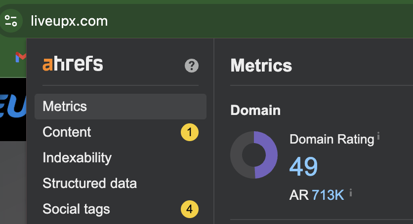
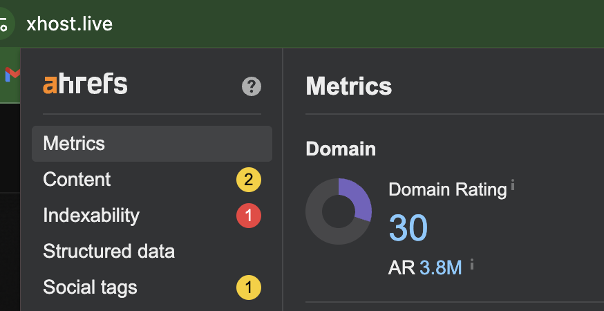
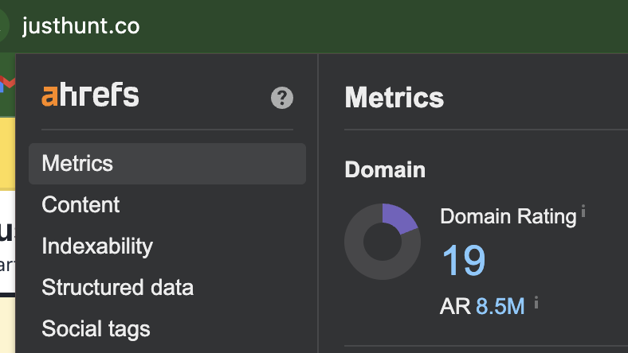
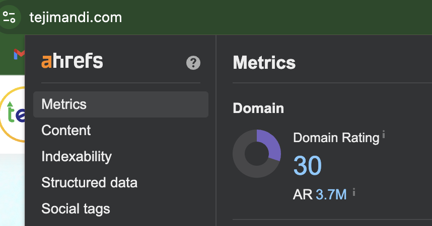
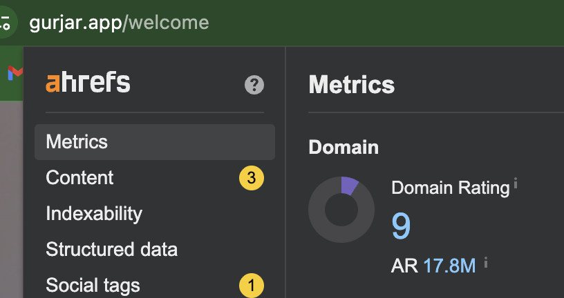

# how-to-increase-domain-rating-DR

# Domain Authority Growth Case Study — DR 0 to 49 in 30 Days

> How we grew 3 domains from **DR 0 to DR 49** in under a month using clean, editorial-quality backlink strategies. Verified on Ahrefs. No PBNs, no spam, no link exchanges.

---

## Table of Contents

- [Overview](#overview)
- [Results Summary](#results-summary)
- [Detailed Results with Proof](#detailed-results-with-proof)
- [Cross-Niche Validation](#cross-niche-validation)
- [Strategy Overview](#strategy-overview)
- [Who Is This For](#who-is-this-for)
- [Get Launch Boost](#get-launch-boost)
- [FAQ](#faq)
- [License](#license)

---

## Overview

Domain authority (DR) is one of the most important trust signals for new websites. A higher DR means faster indexing, better ranking potential, and increased credibility with search engines, press outlets, and potential partners.

Most new domains take **6-12 months** to reach DR 20+. We compressed that timeline to **under 30 days** using a structured, white-hat approach.

This repository documents our case study with full Ahrefs verification screenshots.

---

## Results Summary

| Domain | Age | Domain Rating | Ahrefs Rank | Status |
|--------|-----|:------------:|:-----------:|--------|
| **liveupx.com** | 4 years | **DR 49** | 713K | ✅ Verified |
| **xhost.live** | 3.1 months | **DR 30** | 3.8M | ✅ Verified |
| **justhunt.co** | 2.8 months | **DR 19** | 8.5M | ✅ Verified |

### Client/Partner Domains

| Domain | Domain Rating | Ahrefs Rank | Niche |
|--------|:------------:|:-----------:|-------|
| tejimandi.com | DR 30 | 3.7M | Finance |
| gurjar.app | DR 9 | 17.8M | Community |
| onebanking.app | DR 2 | 40.9M | Fintech |

---

## Detailed Results with Proof

### liveupx.com — DR 49 | AR 713K

Our most established domain. Broke through the competitive DR 40+ barrier within the campaign period.

**Key Metrics:**
- Domain Rating: **49**
- Ahrefs Rank: **713K**
- Domain Age: 4 years
- Campaign Duration: 30 days

---

### xhost.live — DR 30 | AR 3.8M

A 3-month-old domain achieving DR 30 is well ahead of typical growth curves. Most domains at this age are still in single digits.

**Key Metrics:**
- Domain Rating: **30**
- Ahrefs Rank: **3.8M**
- Domain Age: 3.1 months
- Campaign Duration: 30 days

---

### justhunt.co — DR 19 | AR 8.5M

Our newest property, less than 3 months old, achieved DR 19 — putting it months ahead of where most websites land after half a year of active SEO.

**Key Metrics:**
- Domain Rating: **19**
- Ahrefs Rank: **8.5M**
- Domain Age: 2.8 months
- Campaign Duration: 30 days

---

## Cross-Niche Validation

To confirm the strategy works across different verticals, we tested on additional domains:

### tejimandi.com — DR 30 (Finance)

### gurjar.app — DR 9 (Community Platform)

### onebanking.app — DR 2 (Fintech — Newly Launched)

Every domain showed measurable DR growth during the campaign period.

---

## Strategy Overview

### What We Did

1. **Quality-First Backlink Acquisition** — Links from DR 50+ domains with real organic traffic only
2. **Controlled Link Velocity** — Structured to mimic natural growth patterns and avoid spam triggers
3. **Editorial Placements** — Genuine contextual mentions in established publications, not guest post farms
4. **Content Launch Sequence** — Paired with structured content publishing for crawling signals
5. **Technical SEO Foundation** — Clean indexing, fast load times, structured data, XML sitemaps

### What We Avoided

- ❌ Private Blog Networks (PBNs)
- ❌ Fiverr/cheap backlink services
- ❌ Link exchanges or reciprocal schemes
- ❌ Comment/forum spam
- ❌ Doorway pages or cloaking

---

## Who Is This For

This strategy (and the Launch Boost service) is built for:

- **🚀 SaaS Founders** — Skip the authority grind when launching a new product
- **👨‍💻 Indie Hackers** — Build domain credibility alongside your product
- **📰 Startups preparing for press** — Journalists and editors check DR
- **🏢 Agencies** — Offer faster results to client domains
- **🎯 Product Hunt launches** — Maximize SEO impact during your launch window

---

## Get Launch Boost

We've productized this exact strategy into a done-for-you service.

### [→ Learn more at justhunt.co/launch-boost](https://justhunt.co/launch-boost)

**What you get:**
- Done-for-you domain authority growth campaign
- White-hat, editorial-quality backlinks only
- 30-day structured campaign
- Ahrefs-verified results
- Dedicated support throughout

---

## FAQ

### Is this safe / white-hat?

Yes. We use only editorial-quality backlinks from legitimate publications. No PBNs, no spam, no link schemes.

### How fast will I see results?

Most domains show measurable DR movement within 2-3 weeks. The full impact is typically visible by the end of the 30-day campaign.

### Does domain age matter?

It helps, but it's not required. As shown above, domains under 3 months old achieved DR 19-30.

### What's the difference between DR and DA?

DR (Domain Rating) is Ahrefs' metric. DA (Domain Authority) is Moz's metric. Both measure a domain's backlink profile strength. We optimize for DR as it's the industry standard.

### Will this work for any niche?

We've validated across tech, finance, community, and fintech domains. The core strategy applies to any niche, though results may vary based on competitive landscape.

---

## Related Resources

- [Launch Boost Service Page](https://justhunt.co/launch-boost)
- [JustHunt Homepage](https://justhunt.co)
- [What is Domain Rating? — Ahrefs Guide](https://ahrefs.com/blog/domain-rating/)

---

## Keywords

`domain authority` `domain rating growth` `DR growth case study` `increase domain rating` `SEO launch strategy` `backlink building` `white hat SEO` `domain authority from zero` `launch boost SEO` `startup SEO` `indie hacker SEO` `SaaS SEO strategy` `ahrefs domain rating` `fast DR growth` `editorial backlinks`

---

## License

This case study and all associated images are © 2026 JustHunt. All rights reserved.

The data and screenshots are shared for educational and promotional purposes. Do not redistribute without attribution.

---

  <b>Built by <a href="https://justhunt.co">JustHunt</a></b> 
  Launch faster. Rank faster. Build smarter.

